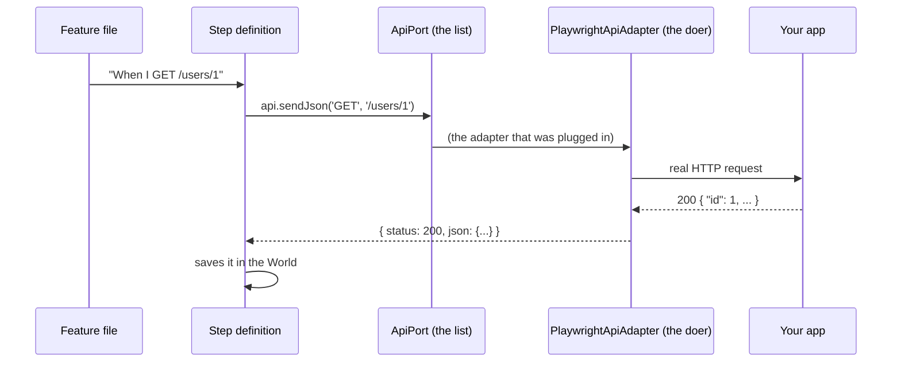

# Ports and Adapters, Explained

This page explains the idea behind how katalyst-xspec is built, in plain language. You don't need it to write tests: most testers only ever touch `.feature` files and `.env`. Read it when you want to understand what happens behind a step, or when you need to change how something works.

## The short version

- A **port** is a list of things the framework needs to be able to do, like "send an HTTP request" or "click a button". It's only a list. It doesn't say *how*.
- An **adapter** is the code that actually does those things, for example using Playwright.
- **Steps only talk to ports.** They never talk to Playwright directly.

So if you want something to work differently, you swap or adjust the adapter. Your feature files and steps stay exactly the same.

## An everyday comparison

Think of a wall socket.

- The **socket** is the port. It has a fixed shape: any appliance with the right plug can use it.
- The **power company** is the adapter. It's what actually supplies the electricity.
- Your **lamp** is a step. It just plugs into the socket and works.

If you switch power companies, you don't rewire your lamp. In the same way, if you change how logging in works (say, to SSO), you don't rewrite your scenarios.

## Follow one step from start to finish

Take this line in a feature file:

```gherkin
When I GET "/users/1"
```

Here's what happens, in order:



1. **The feature file line is matched to a step.** The built-in step for `When I GET {string}` lives in the package.
2. **The step asks the `api` port to send a request.** In code it's roughly `api.sendJson('GET', '/users/1', undefined, world.headers)`. The step doesn't know or care how the request is sent.
3. **The adapter does the real work.** By default that's `PlaywrightApiAdapter`, which uses Playwright to make the HTTP call.
4. **The answer comes back** as a simple object (`status`, `json`, `text`, `headers`).
5. **The step stores it in the World** (`world.lastStatus`, `world.lastJson`), so the next step, such as `Then the response status should be 200`, can check it.

The **World** is the scenario's notepad: a place where one step leaves information for the next. It's reset for every scenario. See [World State](./world-state.md).

## The five ports

Each port covers one kind of job. Next to each is the adapter you get by default.

| Port | What it's for | Default adapter | Used by steps like |
|------|---------------|-----------------|--------------------|
| `ApiPort` | Sending HTTP requests | `PlaywrightApiAdapter` | `When I GET "/users"`, `When I POST "/users" with JSON body:` |
| `UiPort` | Controlling a web browser | `PlaywrightUiAdapter` | `Given I navigate to "/login"`, `When I click the button "Save"` |
| `AuthPort` | Logging in as a role | `UniversalAuthAdapter` | `Given I am authenticated as "pm" via API`, `Given I am logged in as "pm"` |
| `CleanupPort` | Remembering test data to delete afterwards | `DefaultCleanupAdapter` | `I store the value at "id" as "userId"` (when a cleanup rule matches) |
| `TuiPort` | Driving a terminal (command-line) app | `TuiTesterAdapter` | `Given I start the TUI application`, `When I type "help"` |

The full list of methods on each port is in the [Ports reference](../reference/api/ports.md).

## Where adapters get plugged in

There is exactly one place: `features/steps/fixtures.ts`. A new project has this:

```typescript
export const { test } = createBddTest({
  createApi: ({ apiRequest }) => new PlaywrightApiAdapter(apiRequest),
  createUi: ({ page }) => new PlaywrightUiAdapter(page),
  createAuth: ({ api, ui }) => new UniversalAuthAdapter({ api, ui, roles: {} }),
  createCleanup: () => new DefaultCleanupAdapter(),
});
```

Read each line as "**for this port, use this adapter**":

- `createApi` builds whatever answers the `api` port.
- `createUi` builds whatever answers the `ui` port.
- `createAuth` builds whatever answers the `auth` port. It's handed the `api` and `ui` adapters so it can use them to log in.
- `createCleanup` builds whatever answers the `cleanup` port.

Leave out a line and you get the default. `createBddTest()` with nothing inside works too.

These are created fresh for **every scenario**, so one scenario can't leak state into another.

## Do I need to change anything?

Usually not. Work down this list and stop at the first one that solves your problem:

1. **A setting in `.env`.** URLs, login paths, field names and token locations are all settings. See [Configuration](../reference/api/configuration.md) and [Authentication](../guides/authentication.md).
2. **A custom step.** If you need a new sentence for your feature files, write a step. It can use the same ports. See [Custom Steps](../guides/custom-steps.md).
3. **Change one part of an adapter.** If the built-in adapter is nearly right, extend it and change just the method that's different (example 2 below).
4. **Wrap an adapter.** If you want to add something to every call, put your own adapter in front of the built-in one (example 1 below).
5. **Write a brand-new adapter.** Rarely needed, for example to use a completely different HTTP or browser library. See [Custom Adapters](../guides/custom-adapters.md).

## Example 1: add a header to every API request

**Problem:** every request to your API must carry an `x-tenant-id` header.

**Idea:** make a small adapter that adds the header, then hands the request to the normal Playwright adapter. Steps still talk to `ApiPort`, and they never notice the difference.

```typescript
// features/steps/tenant-api.ts
import type { ApiPort, ApiMethod, ApiResult } from '@esimplicitylabs/katalyst-xspec';

export class ApiWithTenantHeader implements ApiPort {
  constructor(private readonly inner: ApiPort, private readonly tenant: string) {}

  sendJson(method: ApiMethod, path: string, body?: unknown, headers?: Record<string, string>): Promise<ApiResult> {
    return this.inner.sendJson(method, path, body, { ...headers, 'x-tenant-id': this.tenant });
  }

  sendForm(method: 'POST' | 'PUT' | 'PATCH', path: string, form: Record<string, string>, headers?: Record<string, string>): Promise<ApiResult> {
    return this.inner.sendForm(method, path, form, { ...headers, 'x-tenant-id': this.tenant });
  }
}
```

Plug it in, in `features/steps/fixtures.ts`:

```typescript
import { createBddTest, PlaywrightApiAdapter } from '@esimplicitylabs/katalyst-xspec';
import { ApiWithTenantHeader } from './tenant-api.js';

export const { test } = createBddTest({
  createApi: ({ apiRequest }) =>
    new ApiWithTenantHeader(new PlaywrightApiAdapter(apiRequest), process.env.TENANT_ID || 'org-a'),
});
```

That's it. Every API step in every scenario now sends the header, and no feature file changed.

## Example 2: log in through SSO

**Problem:** your app uses single sign-on, so the normal login form steps don't fit.

**Idea:** keep the built-in `UniversalAuthAdapter` (it already handles roles, credentials and session reuse) and replace only the part that fills in the login page.

```typescript
// features/steps/sso-auth.ts
import { UniversalAuthAdapter, type Credentials, type World } from '@esimplicitylabs/katalyst-xspec';

export class SsoAuth extends UniversalAuthAdapter {
  protected async uiLogin(_world: World, _role: string, creds: Credentials): Promise<void> {
    await this.ui.goto('/');
    await this.ui.clickButton('Sign in with SSO');
    await this.ui.fillLabel('Email address', creds.username);
    await this.ui.clickButton('Next');
    await this.ui.fillLabel('Password', creds.password);
    await this.ui.clickButton('Verify');
    await this.ui.expectUrlContains('/home');
  }
}
```

```typescript
// features/steps/fixtures.ts
createAuth: ({ api, ui }) => new SsoAuth({ api, ui }),
```

Now `Given I am logged in as "pm"` goes through SSO. The username and password still come from `AUTH_PM_USERNAME` / `AUTH_PM_PASSWORD`, and the session is still reused across scenarios.

Notice that `SsoAuth` uses `this.ui`, which is the **UI port**, not Playwright directly. That's the pattern everywhere: code talks to ports.

## Why it's built this way

- **Your tests survive change.** If the login flow, the HTTP library, or even the test tool changes, only an adapter changes. Hundreds of scenarios stay untouched.
- **Built-in steps work on every project.** The package doesn't know your app, but it doesn't need to: it only needs a working adapter for each port.
- **Small, safe changes.** You change one class in one file (`fixtures.ts`), not a pile of steps.
- **Easy to test the framework itself.** Ports can be faked in unit tests, without a browser or a server.

## Words you'll see

| Word | Meaning |
|------|---------|
| **Port** | A list of abilities the framework needs (for example "send a request"). TypeScript calls this an `interface`. |
| **Adapter** | A class that actually provides those abilities. It "implements" the port. |
| **Step definition** | The code behind one sentence in a feature file. |
| **Fixture** | Something Playwright prepares for each scenario and hands to steps, such as `api`, `ui`, `auth` and `world`. |
| **World** | A per-scenario notepad that steps use to pass data along: last response, stored variables, headers. |
| **`createBddTest`** | The function in `fixtures.ts` where you choose which adapter answers each port. |
| **Implements** | "This class provides everything that port lists." TypeScript checks it for you. |
| **Extends** | "This class is a copy of that class, with some methods changed." Used in example 2. |

## Common mistakes

- **Using Playwright's `page` directly in a custom step.** It works, but it skips the port, so your step won't benefit if the adapter changes later. Prefer `ui` (the port) when it has what you need.
- **Changing a built-in step to fix one app's behaviour.** Change the adapter or a setting instead. The steps are shared by every project.
- **Forgetting `ui` in a custom step that logs in through the browser.** Write `async ({ auth, ui, world }) => …`, or the step fails with "UI login needs the browser".
- **Putting adapter code in feature files or step files.** Adapter choices belong in `features/steps/fixtures.ts`, so there's one place to look.

## Next

- [Architecture](./architecture.md): the same design in more technical detail, with all the layers
- [Ports reference](../reference/api/ports.md): every method on every port
- [Adapters reference](../reference/api/adapters.md): what each built-in adapter does and its options
- [Custom Adapters](../guides/custom-adapters.md): writing your own, step by step
