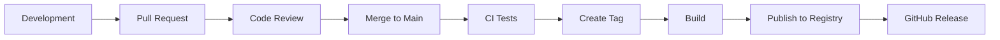

# Release Process

Guide to versioning, releasing, and publishing @esimplicitylabs/katalyst-xspec packages.

## Overview



## Versioning

We follow [Semantic Versioning](https://semver.org/):

| Version | When to Bump | Example Changes |
|---------|--------------|-----------------|
| MAJOR (X.0.0) | Breaking changes | Remove/rename port methods, change fixture API |
| MINOR (0.X.0) | New features | Add new port, add adapter, add steps |
| PATCH (0.0.X) | Bug fixes | Fix adapter bug, improve error messages |

### Pre-release Versions

```
0.1.0-alpha.1    # Alpha release
0.1.0-beta.1     # Beta release
0.1.0-rc.1       # Release candidate
```

## Packages

| Package | Registry |
|---------|----------|
| @esimplicitylabs/katalyst-xspec | npmjs.com |

## Release Workflow

### 1. Prepare Release Branch

```bash
# Ensure main is up to date
git checkout main
git pull origin main

# Create release branch
git checkout -b release/v0.2.0
```

### 2. Update Version Numbers

Update `package.json`:

```bash
# Update katalyst-xspec
cd katalyst-xspec
npm version 0.2.0 --no-git-tag-version
```

### 3. Update Changelog

Add entry to `CHANGELOG.md`:

```markdown
## [0.2.0] - 2024-01-20

### Added
- TUI testing support with TuiPort and TuiTesterAdapter
- New step definitions for terminal UI testing
- `registerTuiSteps` for terminal UI scenarios

### Changed
- Updated Playwright peer dependency to ^1.49.0

### Fixed
- API adapter timeout handling (#123)

### Contributors
- @username1 - TUI adapter implementation
- @username2 - Bug fixes
```

### 4. Build and Test

```bash
# Build all packages
npm run build --workspaces

# Run full test suite
npm test --workspaces

# Run linter
npm run lint --workspaces
```

### 5. Create Pull Request

```bash
git add .
git commit -m "chore: prepare release v0.2.0"
git push origin release/v0.2.0
```

Create PR titled: `Release v0.2.0`

### 6. Merge and Tag

After PR approval and merge:

```bash
git checkout main
git pull origin main

# Create annotated tag
git tag -a v0.2.0 -m "Release v0.2.0"
git push origin v0.2.0
```

### 7. Automated Publishing

Publishing a GitHub Release (`gh release create vX.Y.Z --target main ...`) triggers
`.github/workflows/publish.yml`, which:
1. Installs, builds and tests all workspaces
2. Publishes `@esimplicitylabs/katalyst-xspec` to npmjs.com via npm trusted publishing (OIDC; no stored token). Versions already published are skipped

The workflow can also be run manually from the Actions tab, with an optional dry run.

## Manual Publishing (if needed)

Requires an npm account that's a member of the `esimplicitylabs` org:

```bash
npm login
npm run build
(cd katalyst-xspec && npm publish --access public)
```

## Release Checklist

### Pre-release
- [ ] All tests passing on main
- [ ] Changelog updated
- [ ] Version numbers updated
- [ ] Documentation updated for new features
- [ ] Breaking changes documented
- [ ] Migration guide written (if breaking)

### Release
- [ ] Release branch created and merged
- [ ] Tag created and pushed
- [ ] CI pipeline successful
- [ ] Packages published to registry
- [ ] GitHub Release created

### Post-release
- [ ] Verify packages installable (`npm install @esimplicitylabs/katalyst-xspec@0.2.0`)
- [ ] Announce release (Discord, email, etc.)
- [ ] Update example projects
- [ ] Monitor for issues

## Troubleshooting

### Package not found after publish

```bash
# Check package exists
npm view @esimplicitylabs/katalyst-xspec@0.2.0

# Clear npm cache
npm cache clean --force

# Try installing again
npm install @esimplicitylabs/katalyst-xspec@0.2.0
```

### Authentication errors

```bash
# Local publishing: check you're logged in to npmjs.com
npm whoami
```

In CI, an `E404` / `ENEEDAUTH` on `npm publish` means the trusted publisher on
npmjs.com doesn't exactly match `esimplicityinc` / `katalyst-xspec` / `publish.yml`.

### Version conflict

```bash
# Unpublish (within 72 hours)
npm unpublish @esimplicitylabs/katalyst-xspec@0.2.0

# Or deprecate
npm deprecate @esimplicitylabs/katalyst-xspec@0.2.0 "Use 0.2.1 instead"
```

## Related Guides

- [CONTRIBUTING.md](./CONTRIBUTING.md) - Contribution guidelines
- [Development Setup](./development-setup.md) - Local setup
- [CI/CD Guide](../guides/ci-cd.md) - CI configuration
