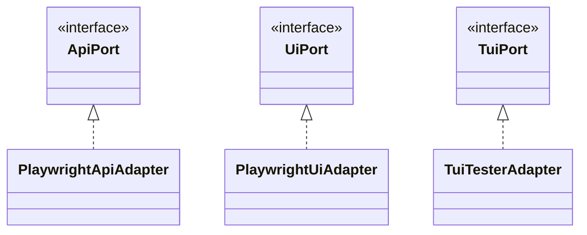

# Adapters Reference

Complete reference for all adapter implementations in @esimplicitylabs/katalyst-xspec.

## Overview

Adapters implement port interfaces using specific technologies.



## PlaywrightApiAdapter

HTTP API adapter using Playwright's request context.

### Import

```typescript
import { PlaywrightApiAdapter } from '@esimplicitylabs/katalyst-xspec';
```

### Constructor

```typescript
new PlaywrightApiAdapter(request: APIRequestContext)
```

| Parameter | Type | Description |
|-----------|------|-------------|
| `request` | `APIRequestContext` | Playwright's API request context |

### Usage

```typescript
import { createBddTest, PlaywrightApiAdapter } from '@esimplicitylabs/katalyst-xspec';

const test = createBddTest({
  createApi: ({ apiRequest }) => new PlaywrightApiAdapter(apiRequest),
});
```

### Features

- Automatic JSON serialization/parsing
- Form URL encoding support
- Response header extraction
- Content-type detection

---

## PlaywrightUiAdapter

Browser UI adapter using Playwright's Page.

### Import

```typescript
import { PlaywrightUiAdapter } from '@esimplicitylabs/katalyst-xspec';
```

### Constructor

```typescript
new PlaywrightUiAdapter(page: Page)
```

| Parameter | Type | Description |
|-----------|------|-------------|
| `page` | `Page` | Playwright Page instance |

### Usage

```typescript
import { createBddTest, PlaywrightUiAdapter } from '@esimplicitylabs/katalyst-xspec';

const test = createBddTest({
  createUi: ({ page }) => new PlaywrightUiAdapter(page),
});
```

### Features

- Semantic locators (role, label, text, placeholder)
- Multiple click modes (click, force click, dispatch)
- Auto-waiting for elements
- URL assertion support
- Multi-tab handling

### Locator Methods

| Method | Playwright API |
|--------|---------------|
| `text` | `getByText()` |
| `label` | `getByLabel()` |
| `placeholder` | `getByPlaceholder()` |
| `role` | `getByRole()` |
| `test ID` | `getByTestId()` |
| `alternative text` | `getByAltText()` |
| `title` | `getByTitle()` |
| `locator` | `locator()` |

### Login helpers

`PlaywrightUiAdapter` also implements the optional [`UiPort` login methods](./ports.md#optional-login-methods) used by `UniversalAuthAdapter`:

| Method | Behavior |
|--------|----------|
| `fillField(name, value, { timeoutMs })` | Tries exact label, exact placeholder, label, placeholder, then `[name="…"]`; returns `false` if none appears |
| `waitForUrl(predicate, timeoutMs)` | `true` once the page URL satisfies `predicate`, `false` on timeout |
| `waitForText(text, timeoutMs)` | `true` once `text` is visible, `false` on timeout |
| `saveSession()` | `page.context().storageState()` (cookies + localStorage) |
| `restoreSession(state)` | Adds the saved cookies and localStorage to the current context |

---

## TuiTesterAdapter

Terminal UI adapter using tui-tester library.

### Import

```typescript
import { TuiTesterAdapter } from '@esimplicitylabs/katalyst-xspec';
```

### Constructor

```typescript
new TuiTesterAdapter(config: TuiConfig)
```

### Configuration

```typescript
type TuiConfig = {
  command: string[];           // Command to run (e.g., ['node', 'cli.js'])
  size?: {                     // Terminal size
    cols: number;              // Default: 80
    rows: number;              // Default: 24
  };
  cwd?: string;                // Working directory
  env?: Record<string, string>; // Environment variables
  debug?: boolean;             // Debug output
  snapshotDir?: string;        // Snapshot directory
  shell?: string;              // Shell to use
};
```

### Usage

```typescript
import { createBddTest, TuiTesterAdapter } from '@esimplicitylabs/katalyst-xspec';

const test = createBddTest({
  createTui: () => new TuiTesterAdapter({
    command: ['node', 'dist/cli.js'],
    size: { cols: 100, rows: 30 },
    debug: process.env.DEBUG === 'true',
  }),
});
```

### Features

- tmux-based terminal emulation
- Keyboard and mouse input
- Screen capture and snapshots
- Pattern matching assertions
- Lazy loading (tui-tester only loaded when used)

### Requirements

- tmux installed on system
- tui-tester npm package (optional peer dependency)

---

## UniversalAuthAdapter

Authentication adapter supporting both API and UI login.

### Import

```typescript
import { UniversalAuthAdapter } from '@esimplicitylabs/katalyst-xspec';
```

### Constructor

```typescript
new UniversalAuthAdapter(options: {
  api: ApiPort;
  ui: UiPort;
  roles?: Record<string, Partial<Credentials>>; // { pm: { username, password } }
  env?: Record<string, string | undefined>;     // default: process.env
})
```

| Option | Type | Description |
|--------|------|-------------|
| `api` | `ApiPort` | API adapter used for API login |
| `ui` | `UiPort` | UI adapter used for form login |
| `roles` | `Record<string, Partial<Credentials>>` | Credentials per role. Take precedence over `AUTH_<ROLE>_*`. |
| `env` | `Record<string, string \| undefined>` | Where settings are read from. Defaults to `process.env`. |

### Usage

```typescript
import { createBddTest, UniversalAuthAdapter } from '@esimplicitylabs/katalyst-xspec';

const test = createBddTest({
  createAuth: ({ api, ui }) =>
    new UniversalAuthAdapter({
      api,
      ui,
      roles: { pm: { username: 'pm@example.com', password: process.env.PM_PASSWORD } },
    }),
});
```

The default `createBddTest()` already uses `new UniversalAuthAdapter({ api, ui })`.

### Roles and credentials

Any role name works. For role `R`, credentials come from `roles` in code, then `AUTH_<R>_USERNAME` / `AUTH_<R>_PASSWORD` (upper-cased; spaces and dashes become `_`). `admin` and `user` also accept the older `DEFAULT_ADMIN_*` and `DEFAULT_USER_*` / `NON_ADMIN_*` names.

Missing credentials throw `MissingCredentialsError`, which fails the step with a message naming the variables to set.

### Settings

API login reads `API_AUTH_LOGIN_PATH`, `API_AUTH_BODY`, `API_AUTH_USERNAME_FIELD`, `API_AUTH_PASSWORD_FIELD` and `API_AUTH_TOKEN_PATH`. UI login reads `UI_LOGIN_PATH`, `UI_USERNAME_FIELD`, `UI_PASSWORD_FIELD`, `UI_LOGIN_BUTTON`, `UI_LOGIN_SUCCESS_URL`, `UI_LOGIN_SUCCESS_TEXT`, `UI_LOGIN_TIMEOUT` and `UI_SESSION_REUSE`. Defaults and examples are in the [Authentication guide](../../guides/authentication.md) and the [Configuration reference](./configuration.md#authentication).

### Methods

| Method | Description |
|--------|-------------|
| `apiLoginAs(world, role)` | API login as `role` |
| `uiLoginAs(world, role, { reuseSession? })` | UI login as `role`, optionally reusing a saved session |
| `apiLoginAsAdmin` / `apiLoginAsUser` / `uiLoginAsAdmin` / `uiLoginAsUser` | Same, for the `admin` / `user` roles |
| `apiSetBearer(world, token)` | Set `Authorization: Bearer <token>` in `world.headers` |
| `credentialsFor(role)` | Resolved `{ username, password }` for a role (throws `MissingCredentialsError`) |

### API login flow

1. POST the credentials to `API_AUTH_LOGIN_PATH` as a form (or JSON with `API_AUTH_BODY=json`)
2. A non-2xx response fails with the status, the response body and the settings to check
3. Read the token (`API_AUTH_TOKEN_PATH`, or the first of `access_token`, `token`, `accessToken`, `data.access_token`, `data.token`, `data.accessToken`) and set `Authorization: Bearer <token>`
4. No token but a `Set-Cookie` header: the cookie session is kept by the request context. Neither: fails.

API login does not start a browser.

### UI login flow

1. Navigate to `UI_LOGIN_PATH` (default `/login`)
2. Fill the username and password fields, matched by label, placeholder or `name`
3. Click `UI_LOGIN_BUTTON`
4. Wait until the page leaves the login page (or shows `UI_LOGIN_SUCCESS_TEXT`, or reaches `UI_LOGIN_SUCCESS_URL`); fail if it doesn't

With `reuseSession`, the session is saved after the first login per role per worker and restored later. `clearUiSessions()` forgets saved sessions.

### Extending

Subclass and override only the part that differs. Role lookup, the steps, and session reuse keep working.

```typescript
import { UniversalAuthAdapter, type Credentials, type World } from '@esimplicitylabs/katalyst-xspec';

export class MyAuth extends UniversalAuthAdapter {
  protected async uiLogin(world: World, role: string, creds: Credentials) {
    await this.ui.goto('/');
    await this.ui.clickButton('Sign in with SSO');
    await this.ui.fillLabel('Email address', creds.username);
    await this.ui.fillLabel('Password', creds.password);
    await this.ui.clickButton('Verify');
    await this.ui.expectUrlContains('/home');
  }
}
```

| Protected member | Description |
|------------------|-------------|
| `apiLogin(world, role, creds)` | POST the login and keep the token/cookie |
| `uiLogin(world, role, creds)` | Fill and submit the form, then check it worked |
| `api`, `ui`, `roles`, `env` | Constructor options |

See [Extending the login](../../guides/authentication.md#extending-the-login).

---

## DefaultCleanupAdapter

Resource cleanup adapter with rule-based cleanup registration.

### Import

```typescript
import { DefaultCleanupAdapter } from '@esimplicitylabs/katalyst-xspec';
```

### Constructor

```typescript
new DefaultCleanupAdapter(options?: {
  rules?: CleanupRule[];
  allowHeuristic?: boolean;
})
```

### Configuration

```typescript
type CleanupRule = {
  varMatch: string;            // Pattern to match variable name
  method?: 'DELETE' | 'POST' | 'PATCH' | 'PUT';  // Default: DELETE
  path: string;                // Cleanup path with {id} placeholder
  body?: unknown;              // Optional request body
};
```

### Usage

```typescript
import { createBddTest, DefaultCleanupAdapter } from '@esimplicitylabs/katalyst-xspec';

// With rules from CLEANUP_RULES env var
const test = createBddTest({
  createCleanup: () => new DefaultCleanupAdapter(),
});

// With explicit rules
const test = createBddTest({
  createCleanup: () => new DefaultCleanupAdapter({
    rules: [
      { varMatch: 'user', path: '/api/users/{id}' },
      { varMatch: 'order', path: '/api/orders/{id}' },
      { varMatch: '/^item_/', method: 'POST', path: '/api/items/{id}/archive', body: { archived: true } },
    ],
    allowHeuristic: false,
  }),
});
```

### Cleanup Rules

No built-in rules are provided. Consumers must define cleanup rules for their application, either via:

1. **`CLEANUP_RULES` env var** -- JSON array of rules
2. **Constructor `rules` param** -- Passed directly in code

Rules from the env var and constructor are merged. Each rule has:
- `varMatch`: substring match against variable name, or `/regex/` syntax for regex matching
- `method`: HTTP method (default: `DELETE`)
- `path`: API path with `{id}` placeholder for the resource ID
- `body`: optional request body (sent as JSON)

### ID Format Support

The cleanup adapter recognizes these ID formats:
- UUIDs (`123e4567-e89b-12d3-a456-426614174000`)
- Prefixed IDs (`org_abc123`, `team_xyz`)
- Numeric IDs (`42`, `99999`)
- MongoDB ObjectIDs (24-char hex)
- CUIDs (`c` + 24+ alphanumeric chars)
- ULIDs (26-char Crockford base32)

### Heuristic Cleanup

When `allowHeuristic: true` (or `CLEANUP_ALLOW_ALL=true`), cleanup is registered for any variable with:
- Name containing `__` (double underscore)
- Name containing `test` (case-insensitive)

### Environment Variables

| Variable | Default | Description |
|----------|---------|-------------|
| `CLEANUP_RULES` | - | JSON array of custom rules |
| `CLEANUP_ALLOW_ALL` | `'false'` | Enable heuristic cleanup |

---

## Cleanup Authentication

By default, cleanup operations log in to the API as the `admin` role (`AUTH_ADMIN_*`, or the older `DEFAULT_ADMIN_*`), using the same `API_AUTH_*` settings. If no admin credentials are set, cleanup runs unauthenticated (best effort). You can customize this with:

### Static Token

Set `CLEANUP_AUTH_TOKEN` env var to use a pre-generated bearer token (no login needed).

### Custom Auth Provider

Pass a `getCleanupAuth` callback to `createBddTest()`:

```typescript
import { createBddTest, type CleanupAuthProvider } from '@esimplicitylabs/katalyst-xspec';

const myAuth: CleanupAuthProvider = async (request) => {
  // Authenticate however your app requires
  return { Authorization: 'Bearer my-token', 'x-custom': 'header' };
};

const test = createBddTest({
  getCleanupAuth: myAuth,
});
```

### OIDC Provider Helper

For OIDC-compliant providers (Keycloak, Auth0, Okta, Azure AD), use the built-in helper:

```typescript
import { createBddTest, createOidcCleanupAuth } from '@esimplicitylabs/katalyst-xspec';

const test = createBddTest({
  getCleanupAuth: createOidcCleanupAuth({
    // All values can also come from OIDC_* env vars
    grantType: 'password',
    extraHeaders: { 'x-user-roles': 'admin' },
  }),
});
```

See [Configuration Reference](./configuration.md#oidc-cleanup-auth-optional) for the full list of `OIDC_*` env vars.

---

## Creating Custom Adapters

### Implement a Port Interface

```typescript
import type { ApiPort, ApiResult, ApiMethod } from '@esimplicitylabs/katalyst-xspec';

export class CustomApiAdapter implements ApiPort {
  async sendJson(
    method: ApiMethod,
    path: string,
    body?: unknown,
    headers?: Record<string, string>
  ): Promise<ApiResult> {
    // Your implementation
  }

  async sendForm(
    method: 'POST' | 'PUT' | 'PATCH',
    path: string,
    form: Record<string, string>,
    headers?: Record<string, string>
  ): Promise<ApiResult> {
    // Your implementation
  }
}
```

### Register Custom Adapter

```typescript
const test = createBddTest({
  createApi: () => new CustomApiAdapter(),
});
```

---

## Related Topics

- [Ports Reference](./ports.md) - Port interfaces
- [Custom Adapters Guide](../../guides/custom-adapters.md) - Creating adapters
- [Architecture](../../concepts/architecture.md) - Design patterns
